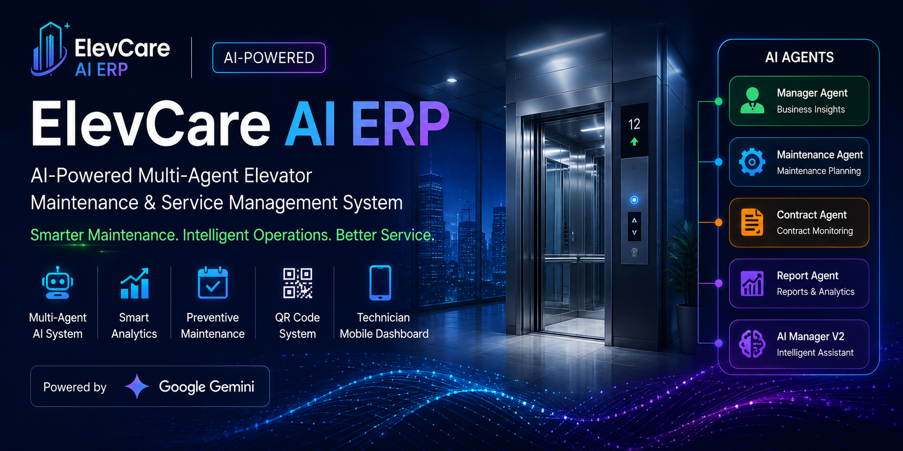
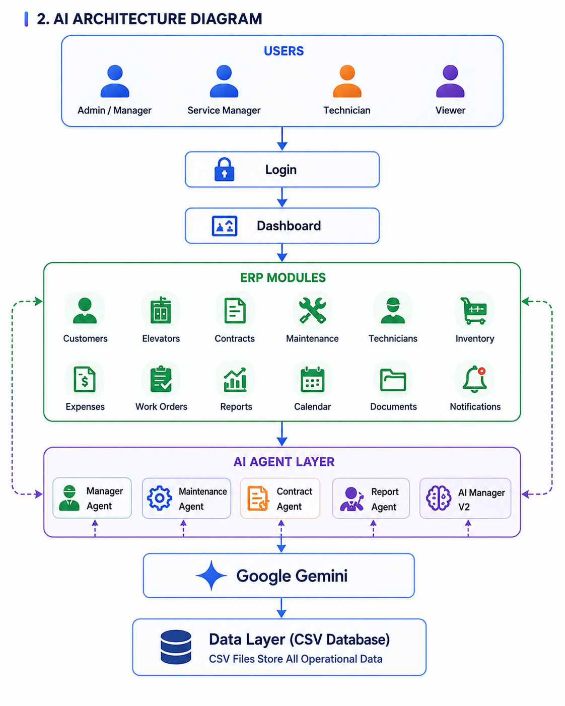
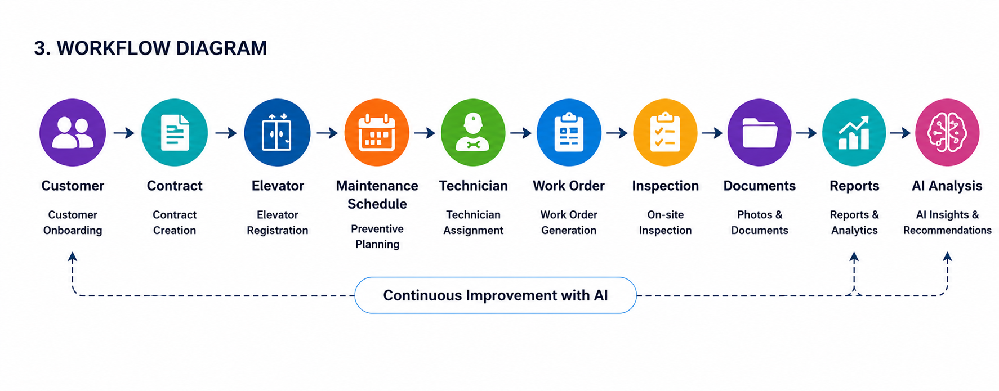
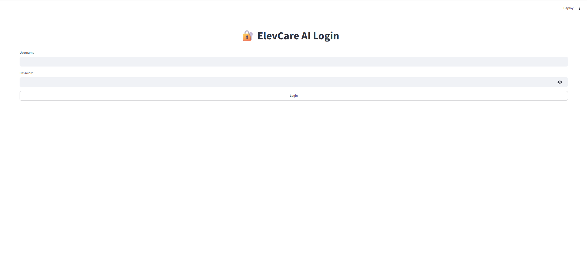
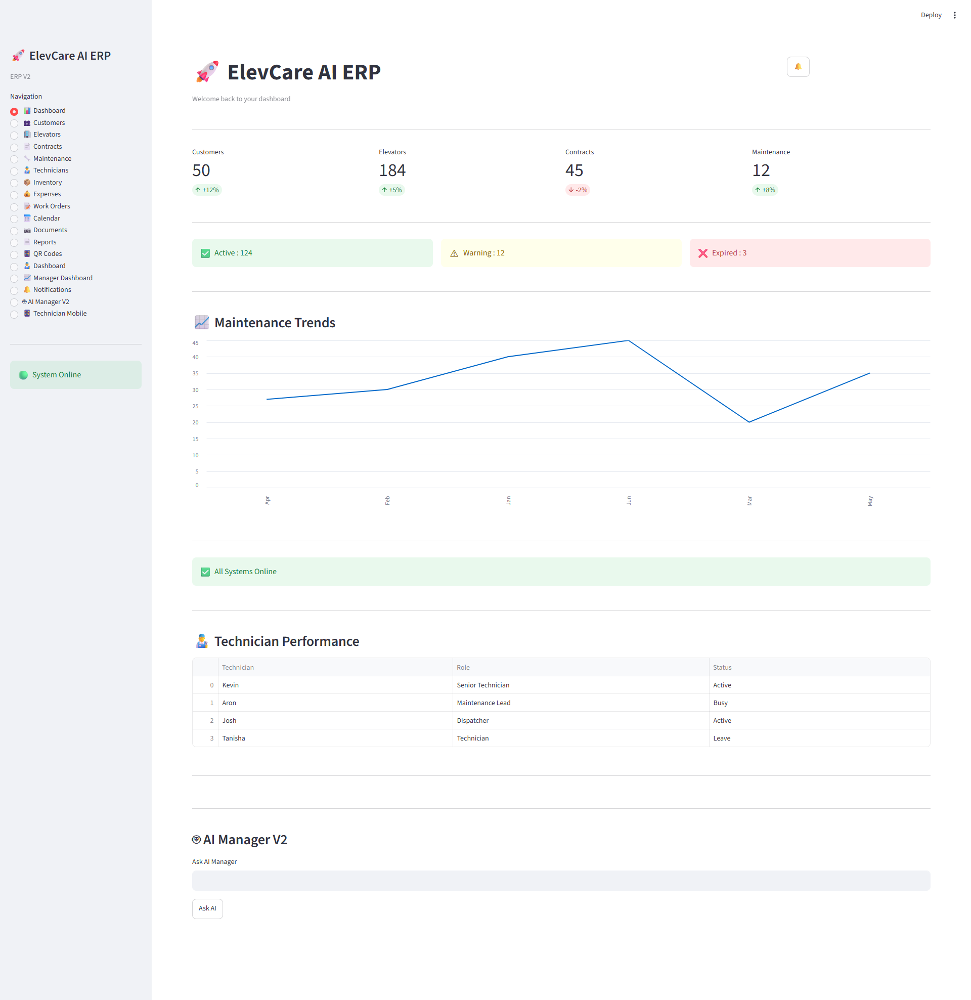
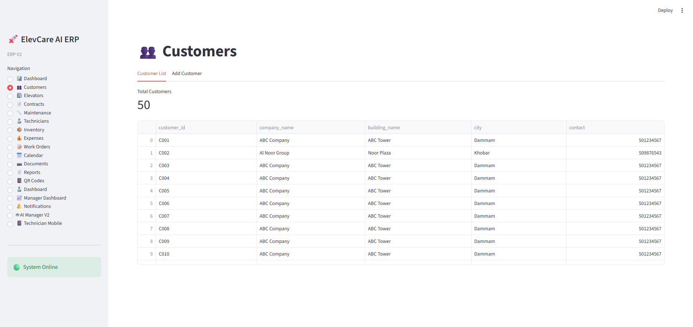
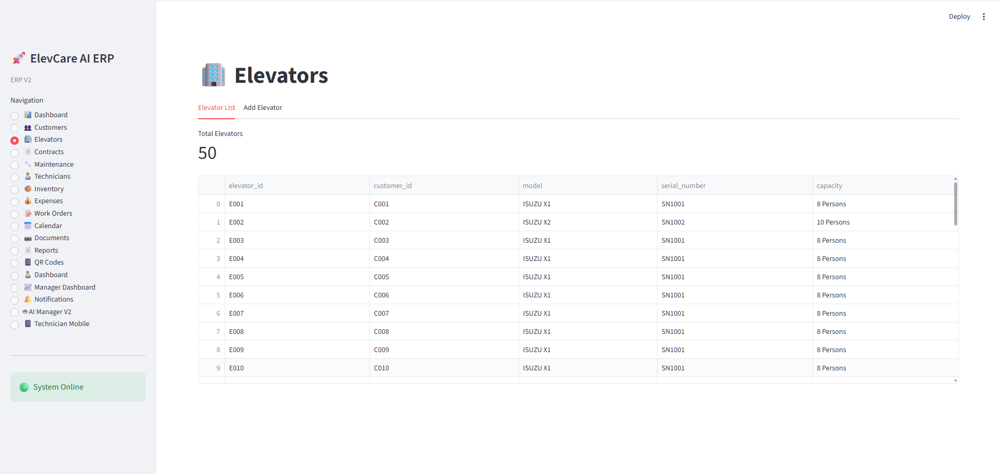
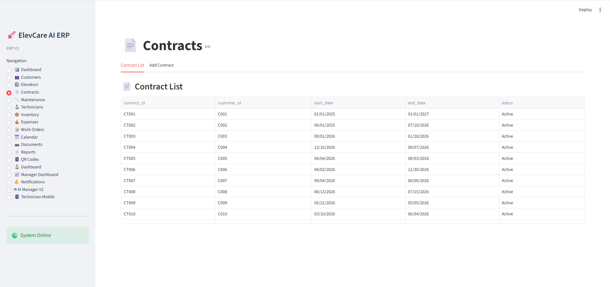
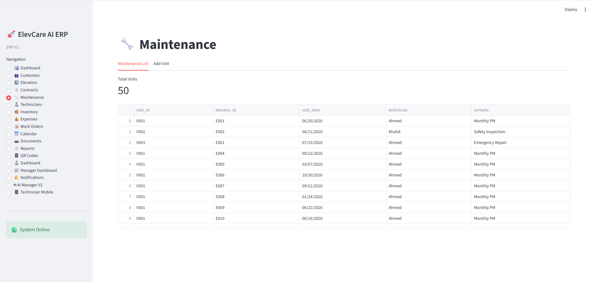
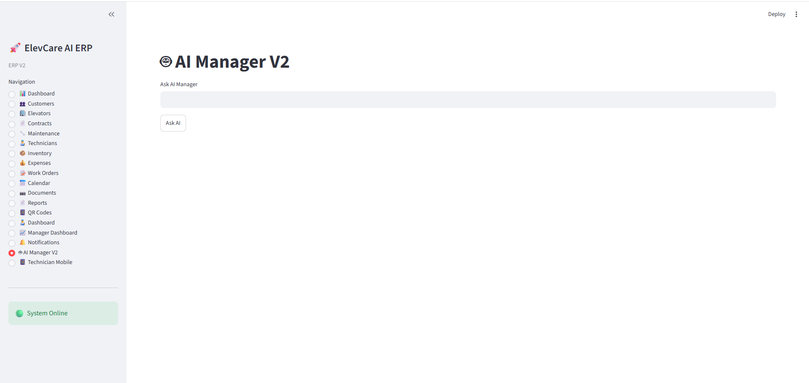

<p align="center">
  
</p>

<p align="center">
  
</p>

<p align="center">
  
</p>
🚀 ElevCare AI ERP

<p align="center">


</p>
> **Production-Grade Multi-Agent Elevator Maintenance Management
> System**\
> Built for the **Google × Kaggle -- 5-Day AI Agents Intensive (Capstone
> Project)**

Production-Grade Multi-Agent Elevator Maintenance Management System

Developed for the Google × Kaggle – 5-Day AI Agents Intensive Capstone Project

Track: Agents for Business

🌟 Overview

ElevCare AI ERP is an AI-powered Elevator Maintenance & Service Management System designed to help elevator companies manage customers, elevators, maintenance schedules, technicians, contracts, inventory, work orders, and reports from a single modern dashboard.

The project follows a Multi-Agent AI Architecture powered by Google Gemini and Google ADK concepts, providing intelligent automation for maintenance operations and business workflows.

------------------------------------------------------------------------

## 📌 Project Overview

ElevCare AI ERP is an AI-powered Elevator Maintenance & Service
Management System designed for elevator companies to manage customers,
elevators, maintenance schedules, technicians, contracts, inventory,
expenses, and work orders from a single dashboard.

The project follows a **multi-agent architecture** where specialized AI
agents collaborate to automate business workflows and assist managers
with operational decisions.

------------------------------------------------------------------------

# 📸 Application Preview

## 🔐 Login



------------------------------------------------------------------------

## 📊 Dashboard



------------------------------------------------------------------------

## 👥 Customers



------------------------------------------------------------------------

## 🏢 Elevators



------------------------------------------------------------------------

## 📄 Contracts



------------------------------------------------------------------------

## 🔧 Maintenance



------------------------------------------------------------------------

## 🤖 AI Manager



------------------------------------------------------------------------

## 👨‍🔧 Technician Mobile Dashboard


------------------------------------------------------------------------

# 🎯 Problem Statement

Many elevator maintenance companies still rely on spreadsheets and
manual paperwork to manage customer records, elevator information,
preventive maintenance, technician assignments, service reports,
inventory, and maintenance contracts.

ElevCare AI ERP digitizes the entire workflow using a modular
AI-assisted ERP platform.

------------------------------------------------------------------------

# 🤖 AI Agents

-   🧠 Manager Agent
-   🔧 Maintenance Agent
-   📄 Contract Agent
-   📊 Report Agent
-   🚀 AI Manager V2

------------------------------------------------------------------------

# ✨ Features

-   Dashboard
-   Customers
-   Elevators
-   Contracts
-   Maintenance
-   Technicians
-   Inventory
-   Expenses
-   Work Orders
-   Reports
-   Notifications
-   QR Code System
-   AI Manager
-   Technician Mobile Dashboard

------------------------------------------------------------------------

# 🛠 Tech Stack

  Technology      Usage
  --------------- ---------------------
  Python          Backend
  Streamlit       Web Application
  Pandas          Data Processing
  CSV             Local Database
  Google Gemini   AI
  Google ADK      Agent Development
  MCP Concepts    Agent Communication
  Git & GitHub    Version Control

------------------------------------------------------------------------

# 📋 Project Status

  Module              Status
  ------------------- --------
  Login               ✅
  Dashboard           ✅
  Customers           ✅
  Elevators           ✅
  Contracts           ✅
  Maintenance         ✅
  Technicians         ✅
  Inventory           ✅
  Expenses            ✅
  Work Orders         ✅
  Reports             ✅
  QR Code             ✅
  Notifications       ✅
  AI Manager          ✅
  Technician Mobile   ✅

------------------------------------------------------------------------

# 📂 Project Structure

``` text
elevcare-ai/
├── agents/
├── app_pages/
├── assets/
│   └── screenshots/
├── components/
├── database/
├── services/
├── dashboard.py
├── requirements.txt
└── README.md
```

------------------------------------------------------------------------

# 🏗 System Architecture

``` text
                    Streamlit Frontend
                           │
                     Dashboard Router
                           │
      Customers • Elevators • Maintenance • Contracts
                           │
                      AI Manager V2
                           │
      Manager Agent • Contract Agent • Maintenance Agent
```

------------------------------------------------------------------------

# 🚀 Getting Started

``` bash
git clone https://github.com/hasanvertex/elevcare-ai.git
cd elevcare-ai
pip install -r requirements.txt
streamlit run dashboard.py
```

------------------------------------------------------------------------

# 🎯 Business Use Cases

-   Elevator Maintenance Companies
-   Facility Management
-   Property Management
-   Building Owners

------------------------------------------------------------------------

# 🔒 Future Improvements

-   Firebase Integration
-   Google Drive Storage
-   Cloud Deployment
-   Mobile Application
-   Predictive Maintenance
-   IoT Integration
-   Voice AI

------------------------------------------------------------------------

# ⭐ Project Highlights

-   ✅ Production-style Multi-Agent Architecture
-   ✅ Built with Python & Streamlit
-   ✅ Google Gemini Integration
-   ✅ Google ADK Concepts
-   ✅ MCP Workflow
-   ✅ Modular ERP Design

------------------------------------------------------------------------

# 👨‍💻 Developer

**Hasan Ahmed**

GitHub: https://github.com/hasanvertex

------------------------------------------------------------------------

# 🏆 Capstone Project

Developed for the **Google × Kaggle -- 5-Day AI Agents Intensive**

**Track:** Agents for Business

------------------------------------------------------------------------

# 📄 License

Educational and demonstration project.
